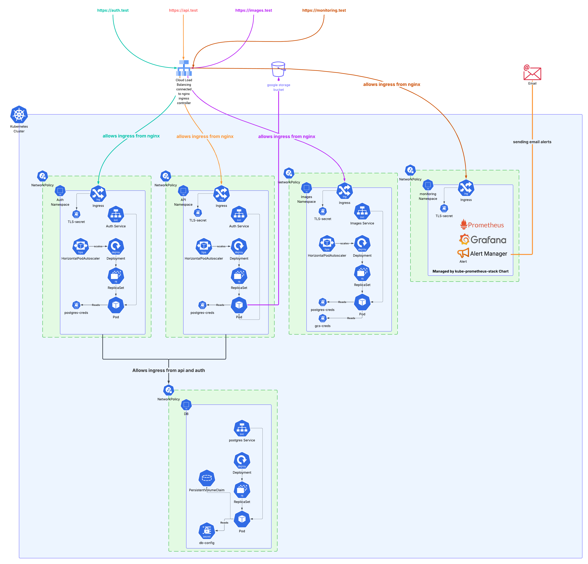
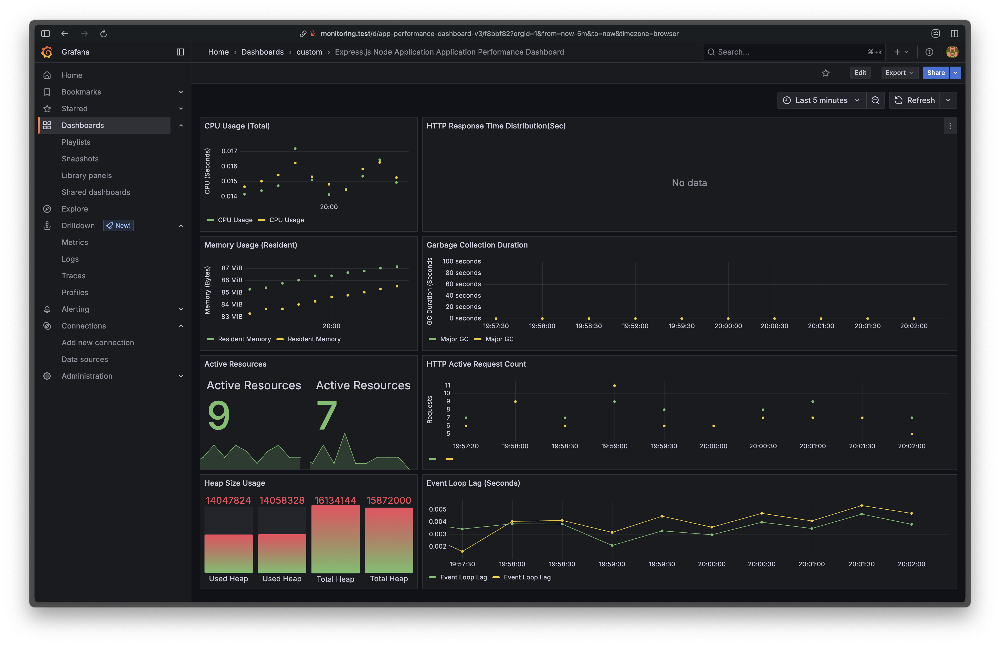
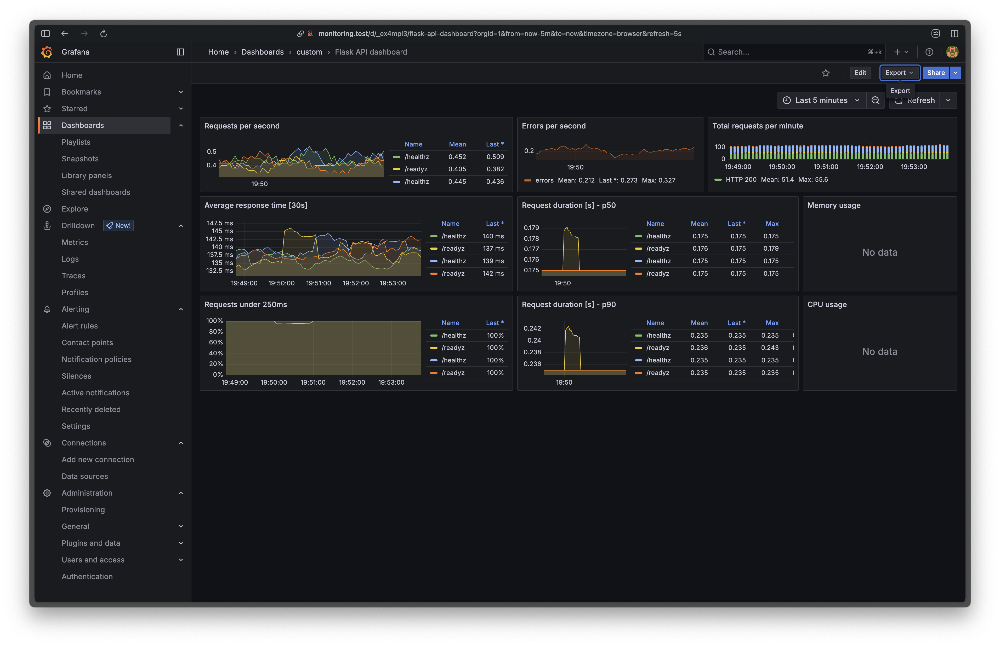

# 🧰 Kubernetes Microservices on Minikube

This project demonstrates the deployment of three microservices (`api`, `auth`, and `images`) using Kubernetes on Minikube, with a focus on best practices for service development, deployment, monitoring, and observability.

---

## 🧭 System Architecture



---

## 📚 Table of Contents

- [🧰 Kubernetes Microservices on Minikube](#-kubernetes-microservices-on-minikube)
  - [🧭 System Architecture](#-system-architecture)
  - [📚 Table of Contents](#-table-of-contents)
    - [🛠️ Environment Setup](#️-environment-setup)
      - [1. 🧱 Service Development](#1--service-development)
      - [2. 🐳 Dockerization and Image Hosting](#2--dockerization-and-image-hosting)
        - [💡 Improvement Suggestions for Build and CI](#-improvement-suggestions-for-build-and-ci)
      - [3. 🚢 Deployment](#3--deployment)
        - [💡 Improvement Suggestions for Deployment](#-improvement-suggestions-for-deployment)
      - [4. 🔐 Secrets \& Configuration](#4--secrets--configuration)
        - [💡 Improvement Suggestions for Secrets Management](#-improvement-suggestions-for-secrets-management)
      - [5. 🌐 Ingress \& TLS](#5--ingress--tls)
      - [6. Network Policies](#6-network-policies)
      - [7. 📊 Monitoring Stack](#7--monitoring-stack)
      - [8. 📈 Autoscaling \& Ensuring Availability](#8--autoscaling--ensuring-availability)
        - [💡 Improvement Suggestions for Autoscaling and Self-healing](#-improvement-suggestions-for-autoscaling-and-self-healing)
      - [9. 🔭 Observability](#9--observability)
        - [suggestions for observability](#suggestions-for-observability)
      - [10. 💥 Failure Simulation, What’s Missing \& What’s Next](#10--failure-simulation-whats-missing--whats-next)

---

### 🛠️ Environment Setup

1. install minikube
2. start minikube

  ```minikube start --driver=docker --addons=ingress```

---

#### 1. 🧱 Service Development

- Developed three microservices with minimal functionality:
  - `api` (Node.js + Express) at `services/api`
    - Port 3000
    - Exposes `/` endpoint
    - Exposes `/healthz` and `/readyz` endpoints which checks the db connection.

    https://github.com/user-attachments/assets/57ca02b9-1124-4736-ae64-7bc60612207f

  - `auth` (Go) at `services/auth`
    - Port 5000
    - Exposes `/` endpoint returning "Hello World"
    - Exposes `/healthz` and `/readyz` endpoints which checks the db connection
    - Uses Redis for session management
  - `images` (Python + Flask) at `services/images`
    - Port 8080
    - Exposes `/images/upload` endpoint
    - Exposes `/healthz` and `/readyz` endpoints which checks the GCS connection
    - Uses Google Cloud Storage for image storage

    https://github.com/user-attachments/assets/b1d8ba48-217f-4e58-b849-1c00e33cdae0
---

#### 2. 🐳 Dockerization and Image Hosting

- Each service includes a `Dockerfile` with its runtime requirements.
- Images are built via CI/CD and pushed to public Docker hub repositories: .github/workflows/ci.yaml

  ##### 💡 Improvement Suggestions for Build and CI

  - Implement multi-stage builds to optimize image size, and reduce attack surface.
  - Use private Docker registry to prevent unsecured access then add image pull secrets to the deployments.
  - Use container scanning tools (e.g., Trivy) to check for vulnerabilities in images in CI/CD pipeline.
  - Use bandit, gosec, eslint-plugin-security to check for security issues is services' code in the CI.

#### 3. 🚢 Deployment

1. create namespaces for each service

    ```sh
    kubectl create namespace api
    kubectl create namespace auth
    kubectl create namespace images
    kubectl create namespace monitoring
    kubectl create namespace infra
    kubectl create namespace db
    ```

2. apply database secret to the namespaces

    ```sh
    kubectl apply -f k8s/secrets/postgres-creds-secret.yaml -n db
    kubectl apply -f k8s/secrets/postgres-creds-secret.yaml -n api
    kubectl apply -f k8s/secrets/postgres-creds-secret.yaml -n auth
    ```

3. ```kubectl apply -k k8s/database```

4. create databases:

    ```sh
    kubectl -n db exec -it $(kubectl -n db get pod -l app=postgres -o jsonpath='{.items[0].metadata.name}') -- psql -U user -d postgres -c "CREATE DATABASE api;" -c "CREATE DATABASE auth;"
    ```

5. deploy api service

    ```sh
    kubectl apply -f k8s/deployments/api-deployment.yaml
    kubectl apply -f k8s/services/api-service.yaml
    kubectl apply -f k8s/ingress/api-ingress.yaml
    ```

6. deploy auth service

    ```sh
    kubectl apply -f k8s/deployments/auth-deployment.yaml
    kubectl apply -f k8s/services/auth-service.yaml
    kubectl apply -f k8s/ingress/auth-ingress.yaml
    ```

7. deploy images service

    ```sh
    kubectl apply -f k8s/deployments/images-deployment.yaml
    kubectl apply -f k8s/services/images-service.yaml
    kubectl apply -f k8s/ingress/images-ingress.yaml
    kubectl apply -f k8s/secrets/gcs-creds.yaml
    ```

8. deploy the TLS secret for the [ingress](#5--ingress--tls)

    ```sh
    kubectl apply -f 'k8s/secrets/wc-cert.yaml' -n api
    kubectl apply -f 'k8s/secrets/wc-cert.yaml' -n auth
    kubectl apply -f 'k8s/secrets/wc-cert.yaml' -n images
    kubectl apply -f 'k8s/secrets/wc-cert.yaml' -n monitoring
    ```

##### 💡 Improvement Suggestions for Deployment

- Set securityContext and runAsNonRoot: true
- Use readOnlyRootFilesystem: true where applicable
- Drop Linux capabilities
- Setup a gitops workflow using ArgoCD or FluxCD to manage deployments and configurations.
  
#### 4. 🔐 Secrets & Configuration

  Used kubectl create secrets to store database credentials in each namespace, gcs access credentials.

  Mounted secrets into pods via environment variables.

##### 💡 Improvement Suggestions for Secrets Management

- use sealed secrets to encrypt secrets at rest in the repository since base64 can be decoded and doesn't provide any encryption. (since this is just a demo, we used base64 encoded secrets in the repo)
- use [kubernetes-reflector](https://github.com/emberstack/kubernetes-reflector) to reflect secrets from the `db` namespace to the `api`, `auth`, and `images` namespaces to make management easier.

#### 5. 🌐 Ingress & TLS

NGINX Ingress controller installed via minikube addon:

```sh
minikube addons enable ingress
```

Switch nginx ingress controller to LoadBalancer type:

```sh
kubectl patch svc ingress-nginx-controller -n ingress-nginx -p '{"spec": {"type": "LoadBalancer"}}'
```

Add hostnames to `/etc/hosts` for local testing:

```sh
echo "127.0.0.1 api.test auth.test images.test monitoring.test" | sudo tee -a /etc/hosts
```

The certificate and TLS secrets are included in the repo but to regenerate them:

```sh
cd certs/test
openssl req -x509 -nodes -days 365 \
  -key test.key \
  -out test.crt \
  -config test-openssl.cnf
```

The certificates are applied to the cluster in step 8 of [3. 🚢 Deployment](#3--deployment)

> **_NOTE:_** We use self-signed certs for local development to avoid DNS validation complexities with Let's Encrypt.

#### 6. Network Policies

  To tighten the security between services, we implemented network policies to restrict traffic flow:

```sh
kubectl apply -f k8s/policies/netpol-default-deny.yaml
kubectl apply -f k8s/policies/netpol-allow-api-auth.yaml
kubectl apply -f k8s/policies/netpol-allow-nginx-to-svcs.yaml
kubectl apply -f k8s/policies/netpol-allow-svcs-db.yaml
```

- The default deny policy blocks all ingress traffic by default.
- The `netpol-allow-api-auth.yaml` allows traffic from the `api` service to the `auth` service.
- The `netpol-allow-nginx-to-svcs.yaml` allows traffic from the NGINX Ingress controller to the `api`, `auth`, and `images` services.
- The `netpol-allow-svcs-db.yaml` allows traffic from the `api` and `auth` services to the database service.

#### 7. 📊 Monitoring Stack

Deployed monitoring with kube-prometheus-stack:

```sh
helm repo add prometheus-community https://prometheus-community.github.io/helm-charts
helm repo update

helm install kube-prometheus-stack prometheus-community/kube-prometheus-stack \
  --version 75.13.0 \
  --namespace monitoring \
  --create-namespace \
  --values k8s/monitoring/kube-prom-values.yaml

# To Upgrade the monitoring stack:
helm upgrade kube-prometheus-stack prometheus-community/kube-prometheus-stack \
  --version 75.13.0 \
  --namespace monitoring \
  --values k8s/monitoring/kube-prom-values.yaml

```

Access Grafana dashboard: <https://monitoring.test>
Default credentials:

- Username: `admin`
- Password: `prom-operator`

#### 8. 📈 Autoscaling & Ensuring Availability

1. Added realistic livenessProbe and readinessProbe to each service to ensure they are healthy before traffic is routed, the explanation of the probes is in the service code. and in section [1. 🧱 Service Development](#1--service-development).

2. Added Horizontal Pod Autoscaler (HPA) for each service to scale based on CPU, memory, and custom metrics (if configured) utilization:

    To apply the HPA configurations:

    ```sh
    kubectl apply -k k8s/autoscaling
    ```

3. PodDisruptionBudget ensured availability during upgrades or maintenance.

##### 💡 Improvement Suggestions for Autoscaling and Self-healing

- Use GitOps practices to manage HPA configurations, allowing for easier rollbacks, versioning and auto-reconciliation (to ensure the desired state of the cluster) via tools like ArgoCD or FluxCD.
- Implement autoscaling using [keda.sh](https://keda.sh/) (Kubernetes Event-driven Autoscaling) for more advanced scaling based on custom metrics or external events.

#### 9. 🔭 Observability

- Integrated prometheus exporter in each service to expose metrics endpoints.
- added serviceMonitor resources to scrape the metrics endpoints of each service by prometheus.
  
  ```sh
  kubectl apply -f k8s/monitoring/service-monitors.yaml
  ```

- Imported the following [dashboard](https://grafana.com/grafana/dashboards/22603-express-js-node-application-application-performance-dashboard/) for nodejs API and learned how to add custom prefix to the metrics from the code, so that the metrics exported match the defaults in the dashboard.
  
- Dashboard for images service
  
- The adapted dashboards are available at `k8s/monitoring/dashboards/` can you imported from Grafana UI.

##### suggestions for observability

- Instrument the services with custom metrics. (e.g., number of uploaded images, failed authentications, DB query duration) are currently instrumented.
- Instrument the services [OpenTelemetry](https://opentelemetry.io/) for distributed tracing across services.
- Implement structured logging in each service to capture key events and errors.
- Use [Loki](https://grafana.com/oss/loki/) for log aggregation and querying.
- Use grafana drill down feature to visualize logs and metrics together for better debugging and performance analysis.
- Add SMTP credentials to kube-prometheus-stack chart values.

#### 10. 💥 Failure Simulation, What’s Missing & What’s Next

- To Be Added: Simulate failures in the services to test resilience and recovery.

To run the traffic generation script:

```sh
pip install requests
python scripts/generate_traffic.py
```

To deploy the entire infrastructure:
```sh
./scripts/deploy_infra.sh
```
